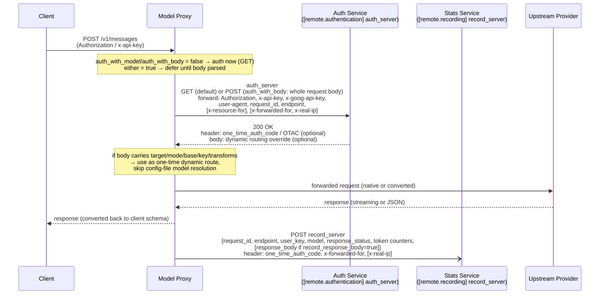

# Model Proxy v3

One proxy, five API schemas. Talk to **Claude**, **Gemini**, **OpenAI Responses**,
and **OpenAI Chat Completions** models through a single endpoint, no matter which
API format your client speaks.

The proxy accepts requests in the Claude Messages, Gemini (GenerateContent /
Interactions), OpenAI Responses and Chat Completions format, converts them
for whatever upstream provider you've configured, and converts the response back.
On top of translation it handles exact / wildcard / catch-all model routing,
composite aliases (weighted, primary+fallback, fusion fan-out, planner→executor
coordinator), schedule-based timetable routing, per-model request/response
transform hooks, global and per-alias token limits, privacy / compression
sidecars, and a web + terminal dashboard for per-model, per-tool, and per-agent
usage stats and some configs modification.

```
 Claude / Gemini genContent & interactions / OpenAI Responses & Chat Completions
                               │
                               ▼            privacy-filter
                        ┌─────────────┐     compression
     sidecar plugins <- │ Model Proxy │ ->  image-fetch & encoding
                        └─────────────┘     auth & usage stats
                               │ 
        ┌──────────────┬───────┴───────┬──────────────┐
        ▼              ▼               ▼              ▼
   Anthropic        Gemini         OpenAI Chat      OpenAI
   Messages       GenContent &     Completions      Responses
                  Interactions     upstream         upstream
                  upstream
```

### Proxy ↔ remote auth & stats service

The two optional remote sidecars (`[remote.authentication] auth_server` and
`[remote.recording] record_server`) can be the **same** service or two separate ones.
`auth_server` gates admission; `record_server` collects per-request usage after the
response. When they are the same service, the proxy can authenticate and
report stats against one backend.



**Auth dynamic-routing override (response body).** The auth service MAY respond
with a JSON body that acts as a **one-time alias config entry** — the same shape
as a `[models.*]` inline table. When present, the proxy uses it directly for
this single request and skips resolving the model from `[models.*]` / `[composite]`
/ `[schedule]` in the config file. All fields are optional; omitted fields fall
back to the normal inheritance chain (`[default_upstream]` → section → entry):

| Body field | Type | Meaning |
|---|---|---|
| `target` | string | Real upstream model id to send (like an alias `target`). |
| `mode` / `upstream_mode` | string | Upstream protocol: `anthropic-messages`, `openai-completions`, `openai-responses`, `gemini-generatecontent`, `gemini-interactions`. |
| `base` / `base_url` | string | Upstream base URL. |
| `key` / `api_key` | string *(optional)* | Upstream API key for this request only. When omitted, the proxy uses the caller's key (subject to `auth_passthrough_with`) or the config-inherited key. |
| `transforms` | string *(optional)* | Comma-separated `[transforms.*]` set names to apply. When omitted, no transforms are attached beyond what config resolution already yields. |

> The override is **per-request and ephemeral** — it is never cached, never
> written to config, and does not persist across requests. If the auth response
> body is empty or not JSON, the proxy falls back to normal config resolution.
> Requires `auth_with_model = true` so the auth call runs after body parsing
> (the proxy needs the requested model id and the override before routing).

See [Auth & Stats Service Protocol](#auth--stats-service-protocol) below for the
full wire-level contract.

## Features

- **Five API formats in, any provider out** — accept requests in any of these schemas:
  - `/v1/messages` — Claude Messages API
  - `/v1beta/models/{model}:generateContent` (+ `:streamGenerateContent`, `:countTokens`) — Gemini GenerateContent API
  - `/v1/interactions` — Gemini Interactions API
  - `/v1/responses` — OpenAI Responses API
  - `/v1/chat/completions` — OpenAI Chat Completions API (always enabled; per-model routed passthrough)
- **Embeddings** — `/v1/embeddings` proxied to an OpenAI-compatible upstream.
- **Model-based routing** — route each model name to its own upstream URL, API key,
  and protocol via a simple TOML config. Exact model keys are supported in every
  `[models.*]` category; provider wildcards (`claude-*`) and the final catch-all
  (`*`) are scoped as described in [Model Routing & Aliases](#model-routing--aliases).
- **Composite aliases** — group several models under one name with weighted-random,
  primary/fallback (with runtime share decay on failure), fusion fan-out, or a
  planner→executor coordinator that hands off once a trigger tool appears.
- **Schedule aliases** — timetable-based routing: pick which model (or composite)
  serves a request based on server-local hour-of-day and day-of-week, with a
  fallback target for any time outside the configured windows.
- **Transform hooks** — per-model / per-upstream request and response rewriting via
  five lifecycle hooks (`request_ingress`, `before_conversion`, `before_upstream`,
  `after_upstream`, `response_egress`), with Tier-1 field ops (rename / set / default
  / remove / map_value) and Tier-2 builtins for cross-message fixes. See
  [Configuration Reference](#configuration-reference).
- **Extended thinking / reasoning** — Claude-style thinking blocks, with conversion to
  OpenAI `reasoning_effort` for upstreams that need it. Handles tag-based
  (`<think>...</think>`) and `reasoning_content` extraction, including streaming and
  cross-chunk tool-call fragment stitching.
- **Usage accounting** — per-model token and request stats, plus per-tool and
  per-agent stats (request/response counts, payload size, block counts), viewable
  in a web dashboard or a live terminal UI.
- **Token limits** — global and per-alias token caps over a configurable window (sliding `Nh`/`Nd` or calendar `1w`/`1m`). Returns HTTP 413 when exceeded.
- **Sidecars** — optional privacy-filter (sidecar or local hash-only mode),
  compression, and image-encode sidecars for redacting, shrinking, or fetching
  request payloads before they reach the upstream.
- **Runs anywhere** — Node.js server or Docker.

## Quick Start

### 1. Install

```bash
git clone <repo-url>
cd model_proxy_v3
npm install
```

> **Do not use `npm install --dry-run --omit=dev` (or `--production`) to preview a production install.**
> Despite `--dry-run`, npm **actually prunes devDependencies from the local `node_modules`** —
> `typescript`, `tsx`, and every agent-SDK dev dep disappear, and the next `npm run build`
> fails with `sh: tsc: command not found`. Fix it by running `npm install` again.
> Such runs can also strip the `optionalDependencies` block from `package.json` — then the
> `@github/keytar` link is never restored by reinstalling alone; see "OS keychain key storage"
> under Configuration Reference for the recovery steps.
> To verify what a consumer would install, use `npm pack --dry-run` instead.

> **Node ≥ 19 recommended.** The proxy uses the Web Crypto global (`crypto.randomUUID()`)
> available natively in Node ≥ 19. On Node 18.17–18.x, either:
> - export `NODE_OPTIONS=--experimental-global-webcrypto` before running any command
>   (`npm run server`, `npm run test:unit`, etc.); or
> - in each source file that calls `crypto.randomUUID()`, add at the top:
>   ```ts
>   import { webcrypto } from 'node:crypto';
>   const crypto = webcrypto;
>   ```
> Node < 18.17 is not supported.

### 2. Configure

Copy the example config and edit it:

```bash
cp proxy_config.example.toml proxy_config.toml
```

A minimal-config walkthrough (model categories, `upstream_mode`, per-model overrides,
wildcards) and the behavioral notes on extended thinking (inline `#` comment support,
third-party `anthropic-messages` endpoints, synthetic thinking signatures,
`budget_tokens` vs `max_tokens`, the `kimi-k2.7-code` `thinking_budget` collision,
tag-based and `reasoning_content` extraction) live in
[`docs/configuration-guide.md`](./docs/configuration-guide.md).

See [`proxy_config.example.toml`](./proxy_config.example.toml) for a fully commented config
covering every section and option.

### 3. Run

```bash
npm run server        # starts on http://localhost:8788
```

Send a request:

```bash
curl http://localhost:8788/v1/messages \
  -H "Content-Type: application/json" \
  -H "x-api-key: your-key" \
  -d '{
    "model": "claude-sonnet-4-5",
    "max_tokens": 1024,
    "messages": [{"role": "user", "content": "Hello!"}]
  }'
```

The proxy reads `proxy_config.toml` from the working directory by default. Point it
elsewhere with `PROXY_CONFIG_PATH=./other.toml npm run server`. Change the port with
`PORT=7777`.

### 4. Watch live stats (optional)

Start with the terminal dashboard:

```bash
TUI=true npm run server
```

You get a live view of configured models, token usage, response times, and tool stats;
a web dashboard is also available at `GET /dashboard`. The `Q` key (documented in the
`h` help panel) opens a model picker with a per-row usage suffix — `(58%)`,
`(7472/20000, 63%)` (remaining/limit + used%), `(¥43.97)` — and shows the highlighted
model's full quota on a status line at the bottom of the panel when moving through the
list (minimax, deepseek, kimi, openrouter, zhipu, qnaigc coding plans — see
`GET /dashboard/api/quota`); anthropic-routed models instead show the 5h-window left
percent recorded from the `anthropic-ratelimit-unified-5h-utilization` response header
on proxied traffic. In the
composite-aliases panel each target model shows its usage left after the timing suffix,
e.g. `[0.11/2.12/63.93s] (58% left)` or `(6930/12000, 42% left)` for count-based
providers. The TUI key bindings, the
`model_proxy_tokens.jsonl` usage-dump format, and the startup stats-restoration rules
are documented in [`docs/live-stats.md`](./docs/live-stats.md).

## API Endpoints

| Endpoint | Purpose |
|---|---|
| `POST /v1/messages` | Claude Messages API |
| `POST /v1/messages/count_tokens` | Count tokens (Claude/OpenAI format) |
| `POST /v1/responses` | OpenAI Responses API |
| `POST /v1/responses/input_tokens` | Count input tokens for a Responses request (forwarded to `/v1/responses/input_tokens` under `openai-responses`, or bridged through Chat Completions token counting under other modes) |
| `POST /v1/responses/compact` | Compact a Responses conversation (forwarded to `/v1/responses/compact` under `openai-responses`, or bridged through Chat Completions under other modes) |
| `POST /v1beta/models/{model}:generateContent` | Gemini content (also `:streamGenerateContent`, `:countTokens`) |
| `POST /v1/interactions` | Gemini Interactions API |
| `POST /v1/embeddings` | Embeddings (proxied to an OpenAI-compatible upstream) |
| `GET /v1/models` | List available models (no auth required) |
| `GET /dashboard` | Web dashboard for config + stats |
| `GET /dashboard/api/quota?model=<id>` | Remaining usage/credits for a model's route (minimax, deepseek, kimi, openrouter, zhipu, qnaigc coding plans; provider detected from the route host). `?base_url=<origin>` variant serves the web dashboard's per-URL "Usage Left" column, falling back to the recorded anthropic 5h percent. Dashboard `api_key` auth. |
| `GET /config-reload` | Reload config from `PROXY_CONFIG_CONSUL` or `PROXY_CONFIG_APOLLO`. Only meaningful when a remote config source is set; returns `400`/`500` otherwise. Clears the config cache and re-fetches. |
| `GET /health` (also `GET /`) | Health check. Probes the resolved default-category / `[default_upstream]` upstream `/v1/models`; returns `{status:"ok", models, cached, version}` on success or `404` when no models are reachable. No auth required. |
| `GET /favicon.ico` | Returns `204 No Content` (browser plumbing). |
| `/{protocol}/{host}/...` dynamic route | Per-request upstream override. See [Dynamic routing](./docs/api-endpoints.md#dynamic-routing). |

A Gemini `/v1/models/{model}:...` variant exists for each `/v1beta/models/{model}:...`
endpoint. `:countTokens` is supported too: native Gemini routes forward to Gemini
`countTokens`, while non-Gemini upstream modes are bridged through the proxy's token-counting path.
For streaming conversions, the proxy forwards final upstream usage where the upstream emits it: OpenAI Chat Completions uses `stream_options.include_usage`, Gemini streams use final `usageMetadata` / interaction usage, and cache-read tokens are preserved through Claude/Responses usage fields when available.
Full request/response examples live in the [API reference docs](#documentation).

### Supported `upstream_mode`

Each endpoint can be routed to one or more upstream API families (`upstream_mode`).
The mode is selected by the route's `defaultMode` / model config:

| Client endpoint | `anthropic-messages` | `openai-completions` | `openai-responses` | `gemini-generatecontent` | `gemini-interactions` |
|---|---|---|---|---|---|
| `POST /v1/messages` | **Native passthrough** to `/v1/messages`; request stays Claude Messages format end-to-end. | **Direct transform**: Claude Messages → Chat Completions → Claude Messages. If input is already OpenAI-shaped, it can pass through. | **Indirect transform via `openai-completions`**: Claude Messages → Chat Completions → Responses `input` → Claude Messages. Basic tools and streaming are supported; `max_tokens` is rewritten to `max_output_tokens`. | **Direct transform**: Claude Messages → Gemini generateContent → Claude Messages. | **Direct transform**: Claude Messages → Gemini Interactions/generateContent-compatible upstream → Claude Messages. |
| `POST /v1/responses` | **Direct transform**: Responses `input`/`instructions` → Claude Messages → Responses. Text and tool-use are supported for non-streaming and streaming. | **Direct transform**: Responses → Chat Completions → Responses. For `api.qnaigc.com`, keeps legacy `max_tokens`; otherwise uses `max_completion_tokens`. | **Native passthrough** to `/v1/responses`. | **Direct transform via Claude Messages**: Responses → Claude Messages → Gemini generateContent → Claude Messages → Responses. | **Direct transform via Claude Messages**: Responses → Claude Messages → Gemini Interactions/generateContent → Claude Messages → Responses. |
| `POST /v1/chat/completions` | **Convert passthrough**: Chat Completions body is converted to Claude Messages format and forwarded to `/v1/messages`; response (streaming and non-streaming) is converted back to OpenAI completions format. Tool schema types are lowercased; `content: ""` on assistant messages with `tool_calls` is normalized to `null`; consecutive tool messages are grouped into one user turn. | **Native passthrough**. Uses the resolved per-model route; composite aliases and `target`-mapped model ids are resolved and the `model` field in the forwarded body is rewritten to the target model id. | **Transform passthrough**: Chat Completions body is converted to Responses `input` and forwarded to `/v1/responses` using the resolved per-model route. | **Transform passthrough**: Chat Completions body (including `image_url` blocks) is converted to Gemini `generateContent` body (`inline_data` for data-URI images; http(s) image URLs are fetched server-side with an SSRF guard) and forwarded to `:generateContent` / `:streamGenerateContent?alt=sse`. Text deltas and `finishReason` round-trip; tool-call/thinking response parts and any model-generated image output are dropped (response schemas for Claude Messages and OpenAI Completions do not carry image output — see [image I/O notes](./docs/api-endpoints.md#image-inputoutput-across-format-boundaries)). | Same as `gemini-generatecontent`; not separately wired today. |
| `POST /v1beta/models/{model}:generateContent` / `:streamGenerateContent` | **Indirect transform via `openai-completions`**: generateContent → Chat Completions → Claude Messages → generateContent. Forwards upstream to `/v1/messages`; text, tool calls, and streaming text deltas return as Gemini `candidates[].content.parts`; tool calls become `functionCall` parts. | **Direct transform**: generateContent → Chat Completions → generateContent. Forwards upstream to `/v1/chat/completions`. | **Indirect transform via `openai-completions`**: generateContent → Chat Completions → Responses `input` → generateContent. Forwards upstream to `/v1/responses`; `system`/`developer` messages become Responses `instructions`; content-part arrays are normalized to text. | **Native passthrough** to `:generateContent` / `:streamGenerateContent` using the configured Gemini API version. | **Native Gemini-family route**; forwards to Gemini generateContent/stream endpoint using Interactions-compatible mode. |
| `POST /v1/interactions` | **Indirect transform via `openai-completions`**: Interactions → Chat Completions → Claude Messages → Interactions. Forwards upstream to `/v1/messages`; text, tool calls, and streaming text deltas return in Interactions shape. | **Direct transform**: Interactions → Chat Completions → Interactions. Forwards upstream to `/v1/chat/completions`. | **Indirect transform via `openai-completions`**: Interactions → Chat Completions → Responses `input` → Interactions. Forwards upstream to `/v1/responses`; `system`/`developer` messages become Responses `instructions`; content-part arrays are normalized to text. | **Native Gemini-family route**; forwards to Gemini generateContent/stream endpoint. | **Native Gemini-family route**; forwards to Gemini generateContent/stream endpoint using Interactions-compatible mode. |
| `GET /v1/models` | Passthrough model listing; no `upstreamMode` conversion is applied. | Passthrough model listing; no `upstreamMode` conversion is applied. | Passthrough model listing; no `upstreamMode` conversion is applied. | Passthrough model listing; no `upstreamMode` conversion is applied. | Passthrough model listing; no `upstreamMode` conversion is applied. |
| `POST /v1/embeddings` | Not supported. | **Only supported mode**; forwards to OpenAI-compatible embeddings upstream. | Not supported. | Not supported. | Not supported. |

Notes:
- **Native passthrough** means the client endpoint and upstream API family already match, so the request body is not converted to another provider's format.
- **Direct transform** means the proxy converts directly between the client endpoint format and the selected upstream family, then converts the response directly back to the client endpoint shape.
- **Direct transform via Claude Messages** means Responses uses Claude Messages as its internal bridge before calling Gemini; it does not go through `openai-completions`.
- **Indirect transform via `openai-completions`** means the request body is routed through OpenAI Chat Completions as an intermediate shape before reaching the target upstream family. This covers two cases: (a) Gemini endpoint input becomes Chat Completions, then becomes Claude Messages or OpenAI Responses; (b) `/v1/messages` routed to an `openai-responses` upstream becomes Chat Completions, then Responses `input`. This reuses the Chat Completions middle mode for code reuse while preserving the original client endpoint response shape.
- Direct transforms are preferred long-term for endpoint fidelity. The current `/v1/interactions` → `anthropic-messages` / `openai-responses` routes use the indirect `openai-completions` bridge for code reuse; see [Routing transform review](./docs/routing-review.md) for tradeoffs and recommendations.


### Token usage statistics columns

The TUI "Top Models" panel and the stats sidecar record token usage per request
from the upstream response (JSON body or final SSE usage event), via
`extractUsageFromResponsePayload` / `createUsageTrackingTransformStream`
(`src/utils/dashboard-stats.ts`). Column semantics per endpoint:

| Endpoint | in | cached | wrote | out |
|---|---|---|---|---|
| `/v1/messages` | `input_tokens` (uncached input only) | `cache_read_input_tokens` | `cache_creation_input_tokens` | `output_tokens` |
| `/v1/chat/completions` | `prompt_tokens` (**includes** cached) | `prompt_cache_hit_tokens` or `prompt_tokens_details.cached_tokens` | `prompt_cache_miss_tokens` (DeepSeek-style) | `completion_tokens` |
| `/v1/responses` | `input_tokens` | `input_tokens_details.cached_tokens` | — (always 0) | `output_tokens` |
| `/v1beta/models/{model}:generateContent` | `promptTokenCount` (**includes** cached) | `cachedContentTokenCount` | — (always 0) | `candidatesTokenCount` |
| `/v1/interactions` | `input_tokens` ?? `total_input_tokens` | only if upstream sends `cache_read_input_tokens` | only if upstream sends `cache_creation_input_tokens` | `output_tokens` ?? `total_output_tokens` |

Notes:
- `total` is the upstream `total_tokens` when present, else computed as `in + cached + wrote + out`.
- For streaming chat/completions, the proxy forces `stream_options.include_usage: true` (native passthrough and converted routes alike) so the upstream emits the final usage chunk; the extra chunk is forwarded to the client unchanged.
- Anthropic's `input_tokens` excludes cached tokens, but OpenAI Chat Completions `prompt_tokens` and Gemini `promptTokenCount` include them — so for those endpoints the computed total counts cached tokens in both `in` and `cached`.

### Endpoint details

Additional endpoint behavior is documented in [`docs/api-endpoints.md`](./docs/api-endpoints.md):

- **Dynamic routing** — per-request upstream override routes `/{protocol}/{host}/...` with an SSRF allowlist (`ALLOWED_HOSTS`).
- **Image input/output across format boundaries** — wire shapes, source-shape handling, who fetches HTTP image URLs, and the model-generated-image limits.
- **OpenAI prompt caching fields** — which of `prompt_cache_key` / `prompt_cache_options` / `prompt_cache_breakpoint` survive each cross-mode conversion.
- **Dashboard API** — the `/dashboard/api/*` JSON routes, optional bearer token, and stats keying by resolved model id.

## Model Routing & Aliases

Incoming model names resolve through three stacked logic levels (see the
[Routing Hierarchy](#routing-hierarchy-logic-levels) table below):

- **Level 1 — `[models.*]`** — exact key → `prefix-*` wildcard → `*` catch-all lookup,
  with `base_url` / `api_key` / `upstream_mode` inherited per-entry → section →
  `[default_upstream]`. An optional per-entry `max_tokens` (e.g.
  `"m" = {target = "...", max_tokens = 8192}`) fills the value when the request omits
  `max_tokens` (`anthropic-messages`) and caps larger client values at the
  `before_upstream` hook (all modes); when unset, the field is strict passthrough —
  the proxy never sets, modifies, or caps it. **Some upstreams require `max_tokens`**
  (e.g. DeepSeek's Anthropic-compatible API rejects requests without it) — configure
  `max_tokens` on those target entries, since the proxy no longer injects a default.
  See [`docs/configuration-reference.md`](./docs/configuration-reference.md).
  `[models.FREE]` and `[models.EMBEDDING]` are exact-only;
  in `[models.FREE]` the configured key always wins, elsewhere the caller's key wins
  by default (`auth_passthrough_with`).
- **Level 2 — `[composite]`** aliases:
  - **share / primary+fallback** — weighted random or ordered fallback, with runtime
    share decay when a target keeps failing, plus optional per-alias `token_limit`.
  - **fusion** — fan-out to parallel panel models with an optional judge and synth.
  - **coordinator** — planner → executor hand-off: routes to the planner until a trigger
    tool call (`ExitPlanMode`, `Edit`, `Write`, …) appears in the conversation history.
- **Level 3 — `[schedule]`** aliases — pick one target by server-local hour-of-day /
  day-of-week windows, with an empty-window fallback target.
- **Token limits** — global (`general.global_token_limit`) and per-alias caps over
  sliding (`1h`–`6d`) or calendar (`1w`/`1m`) windows; HTTP 413 when exceeded.

> **Note — response `model` field reflects the real upstream model, not the
> alias.** The proxy rewrites the *request* body's `model` field from the
> client's alias to the real target model id before forwarding, but the
> *response* body's `model` field (JSON and streaming `chat.completion.chunk`
> events alike) is passthrough by default — clients see whatever the real
> upstream model returns, not the alias they requested. To echo the requested
> alias back instead, attach the `restore_client_model_alias` transform
> built-in to the route — see
> [`docs/transforms-reference.md`](./docs/transforms-reference.md#restore_client_model_alias--echo-the-requested-alias-back-to-the-client).

The full reference — category lookup priority tables, `base_url`/`api_key` override and
"who wins" rules, every composite/fusion/coordinator/schedule option, the token-limit
windowing engine, and worked examples — lives in
[`docs/routing-and-aliases.md`](./docs/routing-and-aliases.md).

## Routing Hierarchy (Logic Levels)

The proxy has **three logic levels**, stacked bottom-up. Each level chooses *which
level below* gets to serve this request:

```
                        ┌────────────────────────────────┐
   Level 3 (top)        │  [schedule]                   │  ← timetable (hour-of-day, day-of-week)
                        │  "what should serve *now*?"   │
                        ├────────────────────────────────┤
   Level 2 (middle)     │  [composite]                  │  ← share / primary+fallback / fusion fan-out / coordinator
                        │  "split or sequence across N?" │
                        ├────────────────────────────────┤
   Level 1 (base)       │  [models.*]                   │  ← exact name / prefix-* wildcard / * catch-all
                        │  "which upstream?"             │
                        └────────────────────────────────┘
```

| Level | Section | Selects by | Cardinality | Re-routes to |
|:-----:|:--------|:-----------|:------------|:-------------|
| 3 | `[schedule]` | Timetable windows | 1 → 1 (one target picked per request) | Level 2 or 1 |
| 2 | `[composite]` (share / primary+fallback) | Weighted random or fallback order | 1 → 1 | Level 1 |
| 2 | `[composite]` (fusion) | Role + `fusion_options` | 1 → N → 1 (panel×N + judge + synth) | Level 1 |
| 2 | `[composite]` (coordinator) | Stage detection via `toolset` in messages history | 1 → 1 (planner → executor, one-way) | Level 1 |
| 1 | `[models.*]` | Exact / `prefix-*` / `*` catch-all | 1 → 1 (one upstream) | — (sends) |


Level-by-level details and worked request-resolution examples are in
[`docs/routing-and-aliases.md`](./docs/routing-and-aliases.md#routing-hierarchy-logic-levels--details).

## Deployment

**Docker**

```bash
cp proxy_config.example.toml proxy_config.toml
#COMMIT=$(git rev-parse --short HEAD)
#docker build --network=host --build-arg VERSION=$COMMIT -t model-proxy-v3:$COMMIT -t model-proxy-v3:latest .
docker build -t model-proxy-v3 .
docker run --network host -p 8788:8788 -v $(pwd)/proxy_config.toml:/app/proxy_config.toml -e LOG_LEVEL=info model-proxy-v3
```

For higher throughput, run several containers behind an nginx reverse proxy that load-balances across them.
Refer to docs/nginx_conf/ for nginx configuration examples.

### npm

The published package ships only the compiled output — `dist/` plus `package.json`,
`README.md`, and `LICENSE` (whitelisted via the `files` field in `package.json`;
`.npmignore` is a backup blocklist). No tests, docs, configs, or source are included.

```bash
# Preview the exact tarball contents (no publish, no side effects):
npm pack --dry-run

# Publish. `prepublishOnly` runs `npm run build` + `npm run test:unit` first,
# so dist/ is always fresh and green in the tarball:
npm publish
```

What the published package gives consumers:

| Field | Value | Meaning |
|---|---|---|
| `main` | `dist/index.js` | ESM entry — the compiled `src/index.ts` fetch handler. |
| `bin` | `model-proxy-v3` → `dist/server.js` | Runnable via `npx model-proxy-v3` or a global install. |
| `files` | `["dist"]` | Only compiled JS is packed. |
| `dependencies` | runtime-only | `typescript` and all agent/test SDKs live in `devDependencies` and are never installed by consumers. |
| `engines` | `node >= 19` | Web Crypto (`crypto.randomUUID()`) requirement. |

Running the published package:

```bash
npx model-proxy-v3                      # or: npm i -g model-proxy-v3 && model-proxy-v3
PORT=8788 model-proxy-v3                # default port is 8788
```

> The server reads `proxy_config.toml` from the **current working directory**.
> When running from elsewhere, point it at the config with
> `PROXY_CONFIG_PATH=/path/to/proxy_config.toml npx model-proxy-v3`.

### Node response compression headers

The Node server adapter normalizes response headers before writing them to the
client. It removes `content-encoding` and `content-length` because Node `fetch()`
can decode upstream-compressed bodies while leaving the original upstream headers
visible on the `Response`. The previous direct header copy:

```ts
Object.fromEntries(response.headers.entries())
```

could therefore send plain text with a stale `content-encoding: br` / `gzip`
header. Clients such as opencode may then try to decode Brotli by default and
fail to read the response body.


## Auth & Stats Service Protocol

The proxy talks to two optional remote services over plain HTTP: an auth service
(`[remote.authentication] auth_server`) that gates admission before routing, and a stats
service (`[remote.recording] record_server`) that collects per-request usage records after
the response. The exact wire-level contract — request/response shapes, forwarded headers,
the `one_time_auth_code` (OTAC) linkage, `auth_with_model` / `auth_with_body` timing, the
dynamic routing override, and how to combine both services in one backend — is documented
in [`docs/auth-stats-protocol.md`](./docs/auth-stats-protocol.md).

## Configuration Reference

Most users only need `proxy_config.toml`; optional environment variables tune behavior.
The full field-by-field reference lives in
[`docs/configuration-reference.md`](./docs/configuration-reference.md):

- **TOML sections** — `[general]`, `[default_upstream]`, `[remote.authentication]`,
  `[remote.recording]`, `[transforms.*]` / `[transform_defaults]`, `[privacy_filter]`,
  `[dashboard]`.
- **OS keychain key storage** — `[general] store_key_in_system = true` moves every
  config `api_key` into the OS keychain (accounts `<target_model_id>/<base_url>` under
  the `model_proxy_v3` service) and rewrites the config file to `STORE_KEY_IN_SYSTEM`
  sentinels; sentinels are resolved from the keychain on every later load, silently, as
  long as the same `node` binary/path keeps reading them — a Node upgrade or a different
  binary path can trigger a one-time OS keychain prompt or a fatal `KeyStoreError` if
  access is denied. Scope:
  configured api_keys of `[models.*]` targets (and `default_upstream.default_api_key`)
  in the local `proxy_config.toml` only — ignored for Consul/Apollo sources, N/A for
  composite aliases, and caller/user keys from request headers are never stored.
  Local/dev-host feature only — fails loud when no OS keychain is available (Docker,
  Cloudflare Workers). Backed by the `@github/keytar` native addon, pinned in
  `optionalDependencies` as `github:github/node-keytar#v7.10.6`: `npm install` fetches
  it from GitHub and its install script downloads a prebuilt NAPI binary — no compiler
  or Python needed (see the toolchain note below). A source copy is kept at
  `submodules/node-keytar` for local development; it is not used by `npm install`.
  If startup fails with `Cannot find package '@github/keytar'`, first check
  `git diff package.json`: npm prune-style runs (`--dry-run --omit=dev`,
  `--production` — see the warning in Quick Start) can strip the
  `optionalDependencies` block, after which no `npm install` ever re-fetches the
  addon; restore it with `git checkout -- package.json && npm install`.
  When a sentinel's exact `<target>/<base_url>` account isn't found, resolution
  falls back to a best-effort search across every stored account for the service
  (`keytar.findCredentials`) — on macOS this broader enumeration can trigger its
  own Keychain Access permission prompt in a separate GUI window (not the
  terminal); if startup appears to hang here, check for that dialog and click
  "Always Allow". This fallback call is bounded to 60s — if it doesn't respond
  in time (e.g. a stuck/dismissed dialog), it fails loud with a clear timeout
  error instead of hanging the process indefinitely.
- **System & toolchain requirements for `store_key_in_system = true`** — the feature
  needs an OS keychain backend at run time. The `@github/keytar` native addon normally
  installs as a prebuilt NAPI binary (ABI 3 — works on any modern Node), so no build
  toolchain is required; a native toolchain (Python 3 + a C++ compiler, via node-gyp)
  is needed only when the prebuilt download fails (e.g. no network access to GitHub
  releases) and npm falls back to compiling the addon from source:

  | Platform | Runtime requirement (OS keychain) | Source-build fallback (node-gyp) |
  |---|---|---|
  | macOS | Keychain Services (built in) | Xcode Command Line Tools (`xcode-select --install`) + Python 3 |
  | Linux | a Secret Service provider — `gnome-keyring` (or KWallet) daemon running, with `libsecret-1` | `build-essential` (gcc/g++/make) + Python 3 + `libsecret-1-dev` headers |
  | Windows | Credential Vault (built in) | Visual Studio Build Tools with the "Desktop development with C++" workload + Python 3 |

  Headless Linux servers need a keyring daemon unlocked in the session (e.g.
  `gnome-keyring-daemon --start --components=secrets` with `DBus` session) or keychain
  access fails. Unsupported environments — Docker/distroless containers, Cloudflare
  Workers — have no OS keychain; with the flag enabled the proxy refuses to start
  (fatal `KeyStoreError`, no silent fallback). The Docker image installs with
  `--omit=optional --ignore-scripts`, so the addon is absent there by design.
- **Environment variables** — core/server (`PORT`, `LOG_LEVEL`, …), config source
  (`PROXY_CONFIG_PATH` / `PROXY_CONFIG_CONSUL` / `PROXY_CONFIG_APOLLO`), token counting &
  upstream, and the privacy-filter / compression / image-encode sidecars.

Also see [`proxy_config.example.toml`](./proxy_config.example.toml) and
[`docs/README_DETAILS.md`](./docs/README_DETAILS.md).

## Testing

```bash
# Coverage testcases: run from the project root; the runner builds an isolated test config.
node tests/run-integration-tests.js --all

# Agent SDK / provider tests live under ./tests and need the proxy running first.
node tests/multi-agents-test.ts
node tests/multi-agents-composite.ts
npm run test:unit

# Point testcases at a specific proxy / key
PROXY_URL=http://localhost:8788 API_KEY=sk-test node tests/run-integration-tests.js --all
```

- Coverage test cases live in [`tests/integration/`](./tests/integration/README.md); use `node tests/run-integration-tests.js --all` or selected suite indices.
- Agent-SDK and provider tests live in [`tests/`](./tests/README.md).

## Documentation

The [`docs/`](./docs/) folder has deep-dives on specific topics:

- **Routing & aliases** — `docs/routing-and-aliases.md` (full `[models.*]` / `[composite]` / `[schedule]` / token-limit reference), plus `proxy_config.example.toml`, `docs/routing_refactor.md`, `docs/routing_config_revision.md`
- **API endpoint details** — `docs/api-endpoints.md` (dynamic routing, image I/O across formats, prompt-caching fields, Dashboard JSON API)
- **Configuration guide** — `docs/configuration-guide.md` (minimal `proxy_config.toml` walkthrough + thinking/reasoning notes)
- **Configuration reference** — `docs/configuration-reference.md` (all TOML sections + environment variables)
- **Auth & stats protocol** — `docs/auth-stats-protocol.md` (wire-level contract for the remote auth/stats sidecars)
- **Config loading** — `docs/config_loader.md`
- **Live stats** — `docs/live-stats.md` (TUI/web dashboard, JSONL usage-dump format, startup stats restoration)
- **Thinking / reasoning** — `docs/claude-extended-thinking.md`, `docs/claude-adaptive-thinking.md`
- **API formats** — `docs/claude-api-reference.md`, `docs/gemini-api-reference.md`, `docs/openai-api-reference.md`
- **Fusion & composite design** — `docs/design_fusion_composite_alias.md`
- **Request/response transform hooks** — `docs/transforms-reference.md` (current reference: hooks, Tier-1 ops, Tier-2 built-ins incl. `restore_client_model_alias`, `[transforms.*]` / `[transform_defaults]` config) — plus `docs/design_request_transform_hooks.md` (original design) and `docs/implementation_of_request_transform_hooks.md` (implementation log)
- **Agent harness integrations** — [`docs/agents/`](./docs/agents/) (per-agent guides; e.g. [using this proxy as an LLM provider for deepseek-harness](./docs/agents/proxy-as-provider-for-deepseek-harness.md))

## Interactive agent session (optional)

Start an interactive [`pi-agent-core`](https://github.com/earendil-works/pi-agent-core)
agent session that uses the proxy's own `/v1/messages` endpoint (loopback) as its LLM
provider — useful for exercising the proxy's routing/quotas/transforms through a real
agent loop without a separate client:

```bash
AGENT=true npm run server
```

`AGENT` and `TUI` are mutually exclusive; if both are set, `AGENT` wins with a warning.

**Flow:** pick a working directory (tools are confined to it) → system prompt loads
`AGENTS.md`/`CLAUDE.md` from that directory, with an optional multi-select for
already-installed `pi` skills (global `~/.pi/agent/skills` or project `.pi/skills`),
plus skills installable on demand from other agents via the [`skills`](https://github.com/vercel-labs/skills)
CLI → pick a model alias from `proxy_config.toml` → a verification message confirms it
replies → set a budget (tokens and/or turns, default 5,000,000 tokens / 100 turns) →
enter a free-text task. The agent runs with `read_file`/`write_file`/`bash` tools (plus
`find_skill`/`add_skill` when the `skills` CLI is available, capped at 5 runtime
installs/session) until the task completes or the budget is hit, then prompts for a
follow-up task in the same conversation. Set `TRAJ=true` to also log the full session
transcript to a private (`0600`), per-session file under `os.tmpdir()`.

**Dependencies:** `pi-agent-core` (bundled), and optionally the `skills` CLI
(`npm install skills`) for the dynamic skill-install tools — omitted with a notice if
unavailable.

**Risks/limits:** ⚠️ no OS-level sandbox — `bash` runs via a plain `/bin/sh -c` child
process with the full privileges of the user running the server. Tool safety is limited
to non-bypassable but simple raw string/regex checks (not a real shell parser): path
confinement to the working directory + `/tmp`, and a denylist of destructive patterns
(`rm -rf`, `kill -9`, `git push --force`, `chmod -R 777`, piping `curl`/`wget` into a
shell). These stop obviously destructive self-inflicted commands, not an adversarial or
sufficiently obfuscated one. Only run agent sessions against working directories and
models you trust. See `src/agent-tools.ts` for the exact checks.

## 🤝 Contributing

1. Fork the repository
2. Create a feature branch
3. Make your changes
4. Submit a pull request

## Models and Tools
### Models Involved
1. `DeepSeek-R1`, `V3.2`, `V4-Flash`, `V4-Pro`
2. `Minimax-M2.6`, `M2.7-highspeed`, `M3`
4. `Kimi-K2.6`, `K2.7-Code`
5. `GPT-5.4-Mini`, `GPT-5.4`, `GPT-5.5`
6. `Gemini-2.5-Flash`, `3.0-Preview`, `3.1-Flash`
7. `Claude-Sonnet-4.5`, `Sonnet-4.6`, `Opus 4.6`, `Opus 4.8`, `Fable 5`
8. `Nemotron-3-Super-120b`, `gpt-oss-120b`
9. `GLM-5.2`, `GLM-5.3`

### Tools Involved
1. `Claude Code`
2. `Kiro`
3. `Gemini-Cli`
4. `Pi`
5. `Codex`
6. `opencode`

## License

This project is licensed under the [MIT License](./LICENSE).
