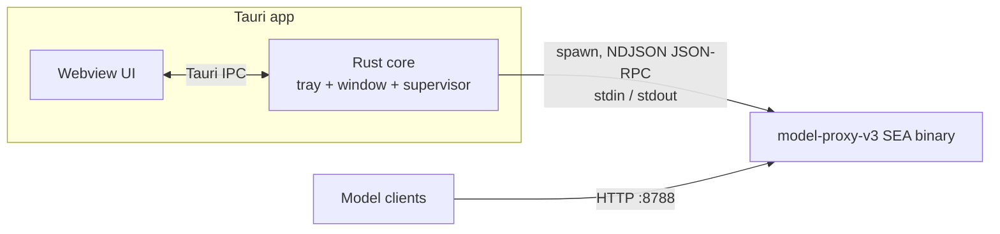

# Design: Tauri UI/Tray for model_proxy_v3 (SEA)

Status: draft / for review
Scope: a Tauri v2 tray/UI app that supervises the `model-proxy-v3` SEA binary and drives it over JSON-RPC 2.0 on stdio; the proxy keeps serving model traffic over HTTP unchanged

---

## 1. Goals

The app supervises the proxy and shows its state. It never proxies model traffic itself — clients keep talking HTTP to the existing server on port 8788.

- Start, stop and restart the bundled proxy binary; show up/down, port and version.
- Show live state: active requests, request and token totals, per-model usage, provider quota.
- Read and write `proxy_config.toml`, then reload the running proxy without a restart.
- Open the existing dashboard (`/dashboard`) in a window or the system browser.
- Run the CLI helpers (`--export-pi-models`, `--export-openclaw-providers`) without a terminal.
- Live in the tray: no terminal window, closes to tray, no dock clutter.

Not in scope: replacing the HTTP API, a chat client, or a rewrite of the in-process TUI (`src/tui.ts`).

## 2. Architecture

The Tauri app owns the proxy process; the proxy keeps serving model traffic over HTTP.



The webview is the frontend and the SEA binary is the backend, but they do not talk directly: the webview uses Tauri's own IPC to the Rust core, and the Rust core is the JSON-RPC client toward the child. The core is also the supervisor — it spawns, watches and kills the child, so tray state and process state cannot disagree.

**Why stdio JSON-RPC instead of just HTTP.** The shell plugin already gives the core a supervised child with writable stdin and line-delimited stdout events, so the control channel and the process handle are the same object. There is no port to discover, no shared secret to pass, and the channel dies with the process it controls. HTTP stays the data plane only.

**Backend change this requires (done).** `src/server.ts` writes its startup banner and logs to stdout, and every level — including `warn` and `error` — funnels through `console.log` in `src/utils/logger.ts`. Since stdout must carry JSON-RPC frames and nothing else, `src/server.ts` now redirects `console.log`/`info`/`debug` to stderr at startup; doing it in one place also covers the direct `console.log/info/debug` call sites in `key-store.ts` and `privacy-filter.ts`, and any added later. Under `AGENT=true` the agent's own output — streamed reply deltas and the pi-tui prompts — is written with `process.stdout.write` and so stays on stdout, while its status/progress lines and the proxy's logs land on stderr. This is the only change to existing behaviour the design forces.

**Option considered and rejected for now:** driving an already-running proxy over its existing `/dashboard/api/*` HTTP endpoints, with no child process. Less code, but it needs a port and a key, and the app cannot start or stop anything.

**Repo topology.** The tray lives in a **separate repo** with `model_proxy_v3` as a git submodule; the RPC surface below is the only thing this repo owes it. Building the SEA binary needs no initialisation of proxy v3's *own* submodules — chatjimmy and keytar are esbuild externals (`scripts/build-sea.js:119`).

## 3. JSON-RPC 2.0 protocol

**Transport and framing.** One JSON-RPC object per line, UTF-8, `\n`-terminated (newline-delimited JSON). JSON escapes literal newlines inside strings, so a line is always exactly one message and no length prefix is needed. Requests go to the child's stdin; responses and notifications come back on its stdout; the child's stderr carries logs. The plugin's stdout events are already split on newlines, so no reassembly logic is required.

**Direction.** The Rust core is the client and the proxy is the server. The proxy also sends *notifications* (no `id`, no reply) for events — the spec permits either side to originate requests, and notifications are the one-way form.

**Shapes.** `params` is always an object (by-name), never a positional array, so fields can be added later without renumbering. `id` is a monotonically increasing integer chosen by the core.

```json
--> {"jsonrpc":"2.0","method":"status.get","params":{},"id":1}
<-- {"jsonrpc":"2.0","result":{"running":true,"port":8788,"version":"3.3.2"},"id":1}
<-- {"jsonrpc":"2.0","method":"stats.tick","params":{"activeRequests":2,"tokensTotal":148233}}
```

**Method surface.** Each method is a thin wrapper over a path the proxy already
exposes, so the RPC layer adds no new state. Params and Result are the fields the
backing handler actually reads and returns, not a paraphrase of them.

| Method | Params | Result | Backed by |
| --- | --- | --- | --- |
| `status.get` | — | `{running, port, version, pid, uptimeMs, activeRequests}` | new (process state) |
| `models.list` | — | sanitized dashboard config payload (`models`/`composite`/`schedule`) | `toDashboardConfigPayload(loadConfig())` (`cli.ts:154`) |
| `config.get` | — | dashboard snapshot | `GET /dashboard/api/config` |
| `config.put` | `{payload}` | dashboard snapshot on success; `{error, config_errors}` on invalid config | `PUT /dashboard/api/config` |
| `config.reload` | — | `{ok}` | `loadConfig(true)` (server.ts closure) |
| `stats.models` | — | `{data: [...]}` per-model totals | `GET /dashboard/api/stats/models` |
| `stats.agents` | — | `{data: [...]}` tool-usage stats | `GET /dashboard/api/stats/agents` |
| `stats.requests` | `{limit?}` | aggregate request statistics (endpoints, upstreams, timings, status codes) | `GET /dashboard/api/stats/requests` |
| `quota.get` | `{model}` or `{baseUrl}` | provider quota | `GET /dashboard/api/quota` |
| `tools.blocklist` | — | `{rows, blockedTools}` | `GET /dashboard/api/tools/blocklist` |
| `tools.toggleBlock` | `{tool_name, blocked}` | `{ok, tool_name, blocked}` | `POST /dashboard/api/tools/toggle-block` |
| `model.test` | `{modelId}` | `{success, modelId, status, detail, usage}` | `POST /dashboard/api/test-model` |
| `tokenLimit.set` | `{value}` | `{ok}` | `POST /dashboard/api/global-token-limit` |
| `schedule.alias` | `{alias, ...}` | dashboard config payload | `POST /dashboard/api/schedule/alias` |
| `shutdown` | — | `{ok}`, then process exit | new |

**Params and Result are the handler's, not a nicer spelling of them.** Every
cell above names what the backing handler actually reads and returns — where an
earlier draft of this table disagreed, the code wins:

- `config.put` takes `{payload}` — the structured dashboard config object
  (`applyDashboardConfigUpdate`), **not** raw TOML. The repo has no TOML
  serializer (`persistProxyConfigToPath` takes a `ProxyConfig` object), so raw
  TOML editing is out of scope for v1 and would need a new serializer.
- `quota.get` needs `{model}` or `{baseUrl}`; the handler 400s without one
  (`dashboard.ts:3517`).
- `tools.toggleBlock` needs `{tool_name, blocked}`; without `blocked` the
  handler always unblocks (`dashboard.ts:3299`).
- `model.test` takes `{modelId}`; a `prompt` param would be ignored — the
  handler uses a fixed `TEST_TOOL_PROMPT` (`dashboard.ts:3331`).
- `tokenLimit.set` takes `{value}` and is global-only
  (`upsertGlobalTokenLimitFromDashboard`, `dashboard.ts:3273`); there is no
  per-alias path here.
- `stats.models` takes **no** params — the handler reads no window argument, so
  a `{window?}` param would be silently ignored.
- `model.test` returns `{success, modelId, status, detail, usage}`, not a
  `{ok, latencyMs, text}` summary; `latencyMs`/`text` have no source.
- `config.put` returns the full dashboard snapshot on success (not `{ok}`), and
  `{error, config_errors}` on a rejected config — the same body the HTTP
  endpoint sends, which is what the `-32001` mapping keys off.
- `config.reload` returns `{ok}` and is backed by the local-file `loadConfig(true)`
  closure, **not** `POST /config-reload` — that route refuses unless a
  Consul/Apollo source is configured (`index.ts:724-726`).

`stats.requests` returns **aggregate** statistics, not a per-request log
(`dashboard.ts:3315-3324`); `limit` slices those aggregate arrays.

**Notifications (proxy → core).** Notifications are **poll-derived**: a 1 s
interval reads existing getters, diffs against the previous sample, and emits
only on change. This keeps `index.ts` and `dashboard-stats.ts` untouched.

| Notification | Params |
| --- | --- |
| `stats.tick` | `{activeRequests, tokensTotal}` |
| `config.changed` | `{path, mtime}` |

`stats.tick` emits `{activeRequests, tokensTotal}` where `tokensTotal` comes
from `getTokensInWindow()` (the windowed sum), **not** a cumulative counter —
there is no `requestsTotal` source in the codebase. `getLiveTokens()` is a
transient in-flight snapshot cleared at stream end, not a total.

`config.changed` is sourced by polling `statSync(PROXY_CONFIG_PATH).mtimeMs`
(config-loader has no watcher).

Dropped for v1: `request.completed` (no per-request feed exists; adding one
requires instrumenting the hot path, which is explicitly declined) and `log`
(stderr already carries logs — see the transport paragraph above; emitting them
on stdout would duplicate and risk interleaving with frames).

**Errors.** The five reserved codes are used exactly as specified; proxy-specific failures use the implementation-defined server range.

| Code | Message | Used for |
| --- | --- | --- |
| -32700 | Parse error | line is not valid JSON |
| -32600 | Invalid Request | not a valid Request object |
| -32601 | Method not found | unknown method |
| -32602 | Invalid params | wrong or missing params |
| -32603 | Internal error | unhandled exception |
| -32001 | Config invalid | config failed validation |
| -32002 | Config not found | `PROXY_CONFIG_PATH` missing |
| -32003 | Model not found | unknown model or alias |
| -32004 | Upstream error | test-model call failed |

A parse error or invalid request is answered with `"id": null`, per the spec. Notifications never get a reply, including on error.

**Readiness and lifecycle.** The RPC reader starts *inside* the `server.listen`
callback, so the HTTP socket is already bound before the first request is read.
`status.get` answering at all therefore proves the port is live — no probe and
no `ready` notification are needed. If the port is taken, `listen` fails, the
callback never runs, RPC never starts, and the child exits; the tray sees
`Terminated` (fail loud). Stdin is an OS pipe, so requests written before the
reader attaches are buffered — there is no startup race. **Stdin EOF shuts the
proxy down**: when the Tauri core dies the pipe closes, which prevents a
headless orphan holding port 8788.

`--rpc` is selected by a **flag**, handled in `server.ts` before `runCli()`,
because `runCli()` rejects unknown args (`cli.ts:93-96`) and exits after every
command (`server.ts:82-85`) — `--rpc` is a *mode*, not a CLI command. It is
mutually exclusive with `TUI` and `AGENT` (all three want stdout) and fails loud
rather than picking a winner.

## 4. Tauri shell plugin

The plugin spawns the bundled binary and hands the core its stdout as line events.

**Install.** In `src-tauri`: `cargo add tauri-plugin-shell`, then register it in `src-tauri/src/lib.rs`:

```rust
tauri::Builder::default()
    .plugin(tauri_plugin_shell::init())
    .run(tauri::generate_context!())
    .expect("error while running tauri application");
```

**Bundle the binary.** In `src-tauri/tauri.conf.json`:

```json
{ "bundle": { "externalBin": ["binaries/model-proxy-v3"] } }
```

The file on disk must carry the target triple suffix — `src-tauri/binaries/model-proxy-v3-aarch64-apple-darwin` on Apple Silicon. Get yours with `rustc --print host-tuple`. `scripts/build-sea.js` already emits a platform-tagged name, so the build needs one rename into `src-tauri/binaries/`.

**Spawn and read.** `sidecar()` takes the bare name, not the `externalBin` path:

```rust
use tauri_plugin_shell::{ShellExt, process::CommandEvent};

let cmd = app.shell().sidecar("model-proxy-v3")?.args(["--rpc"]);
let (mut rx, mut child) = cmd.spawn()?;

tauri::async_runtime::spawn(async move {
    while let Some(event) = rx.recv().await {
        match event {
            CommandEvent::Stdout(line) => handle_frame(&String::from_utf8_lossy(&line)),
            CommandEvent::Stderr(line) => eprintln!("{}", String::from_utf8_lossy(&line)),
            CommandEvent::Terminated(_) => set_stopped(),
            _ => {}
        }
    }
});
```

**Write and kill.** `child.write(frame.as_bytes())?` sends a request; `child.kill()?` stops the proxy. One `CommandEvent::Stdout` is one line, which is exactly the NDJSON framing — no reassembly.

**Permissions.** `src-tauri/capabilities/default.json` must name the sidecar and grant spawn, stdin write and kill:

```json
{
  "identifier": "default",
  "windows": ["main"],
  "permissions": [
    "core:default",
    {
      "identifier": "shell:allow-spawn",
      "allow": [
        { "name": "binaries/model-proxy-v3", "sidecar": true, "args": true }
      ]
    },
    "shell:allow-stdin-write",
    "shell:allow-kill"
  ]
}
```

`shell:allow-execute` is the one-shot `.execute()` permission; a long-lived child needs `shell:allow-spawn`. Every shell command is denied until listed here.

The tray's capability also lists two things this block omits: `opener:default`,
because Open Dashboard hands a `http://` URL to the system browser, and
`shell:allow-execute` for the same sidecar, because the two `--export-*` helpers
are one-shot runs rather than long-lived children.

## 5. Tray UX

The app is tray-first: it starts with no window, and the proxy lives as long as the icon does. Enable the tray with the `tray-icon` feature in `src-tauri/Cargo.toml`.

| Menu item | Action |
| --- | --- |
| Status (disabled) | `Running on :8788 · v3.3.2` or `Stopped` |
| Start / Stop | toggles the child — spawn, or send `shutdown` |
| Restart | kill, then spawn |
| Open Dashboard | opens `http://127.0.0.1:<port>/dashboard` in the system browser |
| Reload Config | sends `config.reload` |
| Export Provider Config ▸ | runs `--export-pi-models` or `--export-openclaw-providers` and shows the block in the window |
| Quit | sends `shutdown`, then exits the app |

**Icon state carries the status:** green running, grey stopped, amber when the last `config.reload` reported an error. A tray icon is the only status surface visible when the window is hidden, so the three states must be distinguishable at icon size.

**Window behaviour.** The window is the app's **own status/export surface** — tray state, live counters, the resolved config path, the last export block — and it is not the dashboard. Open Dashboard hands `/dashboard` to the system browser instead, so the window still says something when the child is down; a webview pointed at a server the app itself stopped is a blank page. Left click opens the window; the menu is bound to right click (`show_menu_on_left_click(false)`). Closing the window hides it — only Quit stops the proxy.

**Platform note.** Tray mouse events (`Click`, `DoubleClick`, `Enter`, `Move`, `Leave`) are not emitted on Linux; the menu still works there, so nothing may depend on hover or click handlers.

## 6. Packaging and distribution

The tray ships the proxy, so the build order is fixed: build the SEA binary first, then the Tauri bundle.

1. `npm run build:native` → `dist/model-proxy-v3-macos-arm64` (or `-linux-x64`, `-win.exe`).
2. Copy it into `src-tauri/binaries/` with the target-triple suffix `externalBin` requires.
3. `tauri build` → an app bundle with the proxy inside.

**No cross-compilation at either layer.** `scripts/build-sea.js` embeds a copy of the Node that ran it, so the binary is bound to that platform and architecture, and the Tauri bundle is per-platform too. CI must run the whole chain on each target runner — the same shape the repo already needs for native releases.

**macOS signing.** Injection invalidates the signature, so `build-sea.js` already removes and re-applies an ad-hoc signature. Distribution then needs the app bundle signed with a real identity and notarized, and an ad-hoc signed sidecar inside a notarized bundle is a known failure point worth verifying early.

**Size.** The sidecar is a copy of a full Node binary — on the order of 100 MB before compression — so the bundle is large next to a typical Tauri app. Measure before picking a distribution channel.

**Windows caveat.** The build excludes `@github/keytar`, so `store_key_in_system = true` falls back to the in-binary body store, which keeps keys in plaintext inside the executable and needs a writable directory. That is a real difference from the macOS and Linux builds and belongs in the UI or the README.

## 7. Open questions and risks

| Question | Why it matters | Leaning |
| --- | --- | --- |
| ~~Embed `/dashboard` in a webview, or rebuild the views over JSON-RPC?~~ | **Resolved: neither.** The window is a small status/export surface rebuilt over JSON-RPC, and Open Dashboard opens `/dashboard` in the system browser. Embedding was less work but leaves the window blank whenever the child is down; rebuilding the dashboard's views would duplicate a 3,600-line handler. This surface is deliberately far smaller than the dashboard. | Rebuild a small UI |
| ~~How is RPC mode selected — `--rpc` flag or `PROXY_RPC=1`?~~ | **Resolved: `--rpc` flag.** Handled in `server.ts` before `runCli()` (which rejects unknown args, `cli.ts:93-96`, and exits after every command, `server.ts:82-85`). Mutually exclusive with `TUI`/`AGENT`; fails loud rather than picking a winner. | `--rpc` |
| Do logs move to stderr only in RPC mode, or always? | Always is simpler and matches container practice; RPC-only leaves today's console output untouched | Always — done; `AGENT=true`'s own reply output stays on stdout |
| ~~Port 8788 already in use — adopt the running proxy or fail?~~ | **Resolved: fail loud** is the only option this transport allows — a process you did not spawn cannot be adopted over stdio. Adopting would require the rejected HTTP control path. | Fail loud |
| Absolute `PROXY_CONFIG_PATH` on GUI launch | A GUI app's working directory is not the repo, so the relative default reads the wrong file or none | Pass explicitly |
| Single instance | Two tray icons would fight over the same port | `tauri-plugin-single-instance` |
| Windows key storage | The body store keeps keys in plaintext inside the executable | Accept, but surface it |

The largest risk was the first row: embedding the dashboard would have made the window a thin shell over a server the app itself may have stopped, while rebuilding the dashboard's views would duplicate a 3,600-line handler. The resolution above takes neither — a small purpose-built surface, with the dashboard left where it already works.
